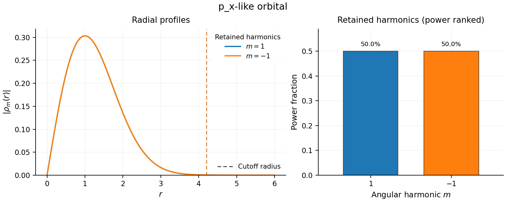

# PETAL2D

[](https://github.com/QuantumArtificer/petal2d/actions/workflows/tests.yml)
[](https://github.com/QuantumArtificer/petal2d/actions/workflows/docs.yml)
[](LICENSE)

PETAL2D (Polar Expansion Toolkit for Atomic Orbitals and Localized Fields in 2D) decomposes localized two-dimensional real or complex scalar fields into polar angular harmonics while retaining their radial structure.

For a field written as

$$
f(r,\theta)=\sum_{m\in\mathbb Z}\rho_m(r)e^{im\theta},
$$

PETAL2D computes the radial profiles $\rho_m(r)$ and their polar-area-weighted powers

$$
P_m=\int_0^{r_{\max}} |\rho_m(r)|^2 r\,dr.
$$

The angular channels can then be ranked by power and used to construct controlled reconstructions. PETAL2D also reports the radial extent of retained channels, angular sampling limits, domain coverage, and reconstruction errors.

## Installation

Install a development checkout with

```bash
git clone https://github.com/QuantumArtificer/petal2d.git
cd petal2d
python -m pip install -e .
```

For tests and documentation:

```bash
python -m pip install -e ".[test,docs]"
```

PETAL2D requires Python 3.10 or newer, NumPy 1.23 or newer, SciPy 1.9 or newer, and Matplotlib 3.6 or newer.

## Quick start

```python
import numpy as np
from petal2d import PolarDecomposition

x = np.linspace(-6.0, 6.0, 161)
y = np.linspace(-6.0, 6.0, 161)

def px(x, y):
    return x * np.exp(-0.5 * (x**2 + y**2))

dec = PolarDecomposition(
    px,
    x,
    y,
    Nr=160,
    Ntheta=256,
    recon_err_tol=1e-8,
)

print(dec.selected_pairs)
print(dec.m_sorted.tolist())
print(f"{dec.domain_consistency:.8f}")
print(f"{dec.recon_error_measured:.6g}")
```

```text
[(1, -1)]
[1, -1]
1.00000003
2.70394e-14
```

The real $p_x$-like field contains equal $m=+1$ and $m=-1$ components. PETAL2D keeps the conjugate pair together so that the adaptive reconstruction remains real.



The complete script is available in [`examples/px_orbital.py`](examples/px_orbital.py).

## Inputs and outputs

PETAL2D accepts either an analytic callable or a two-dimensional array sampled on a uniform Cartesian grid.

The main decomposition provides:

- the complete discrete angular spectrum
- retained harmonics selected by a requested reconstruction error
- radial profiles $\rho_m(r)$
- angular power fractions
- measured and Parseval-predicted reconstruction errors
- conjugate-pair selection for real fields
- `domain_consistency` for the analyzed polar disk
- angular Nyquist information
- radial power-support and amplitude-support radii
- `cutoff_radius` as the stricter radial-extent diagnostic

Reconstruction can use the retained spectrum, the complete spectrum, or an explicit set of angular harmonics.

## Applications

PETAL2D is intended for localized 2D fields whose angular structure is meaningful about a chosen center. Examples include:

- planar atomic and molecular orbitals
- Wannier and other localized crystal orbitals
- defect, impurity, and bound-state wavefunctions
- localized moiré states around high-symmetry regions
- complex order parameters and vortex states
- charge, probability, and scalar spin-density anisotropy
- excitonic relative-coordinate wavefunctions
- localized photonic, phononic, acoustic, and PDE eigenmodes
- angular descriptors of localized simulation or image data

For a complex wavefunction, the harmonic index $m$ labels the planar $L_z/\hbar$ sector about the chosen origin. For a density such as $|\psi|^2$, the same decomposition describes angular morphology and does not recover the phase removed by taking the modulus square.

PETAL2D is not a replacement for a Cartesian FFT, a three-dimensional spherical-harmonic expansion, a vector or tensor harmonic decomposition, or a crystallographic point-group analysis.

## Documentation

- [Getting started](docs/source/getting_started.md)
- [User guide](docs/source/user_guide/index.md)
- [API reference](docs/source/reference/index.rst)
- [Guided examples](docs/source/examples/index.md)
- [Validation and benchmarks](docs/source/validation/index.md)
- [Theory](docs/source/theory/index.md)
- [Proofs](docs/source/theory/proofs.md)

Build the documentation locally with

```bash
python -m sphinx -W --keep-going -b html docs/source docs/_build/html
```

## Validation and tests

Run the test suite with

```bash
python -m pytest -q
```

The numerical validation suite covers interpolation accuracy, radial convergence, angular sampling and aliasing, real-field Nyquist behavior, and adaptive truncation. The benchmark suite records runtime and peak-memory measurements separately from the validation studies.

Run the full validation and benchmark workflow with

```bash
./tools/run_full_validation_and_benchmarks.sh
```

See [`validation/README.md`](validation/README.md) and [`benchmarks/README.md`](benchmarks/README.md) for the individual studies.

## Citation

Citation metadata are provided in [`CITATION.cff`](CITATION.cff). A versioned DOI will be added with the first archived release.

## Contributing

See [`CONTRIBUTING.md`](CONTRIBUTING.md) and the [development guide](docs/source/development/index.md).

## License

PETAL2D is distributed under the MIT License. See [`LICENSE`](LICENSE).

Alex Santacruz, 2DQMAT Research @ IF-UNAM
